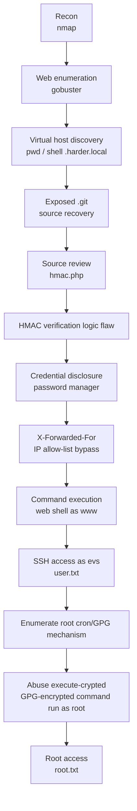

# Harder — TryHackMe Walkthrough

A full recon-to-root walkthrough of the **[TryHackMe "Harder"](https://tryhackme.com)** room. The most
interesting part of this box is not a ready-made exploit — it is **recovering the
application's source code from an exposed `.git` directory and finding a logic flaw in its
HMAC verification**, then chaining that into command execution and a GPG-based privilege
escalation to root.

> **Scope & ethics:** This was performed against an **intentionally vulnerable, isolated
> TryHackMe training environment** that I am authorised to attack. It is **not** a real
> penetration test, a client engagement, a real organisation, or original vulnerability
> research. The vulnerabilities are deliberately planted by the room author. All
> credentials, session cookies, and flags in the screenshots have been redacted.

---

## Attack chain



## What this demonstrates

- **Offensive web methodology** — structured recon → enumeration → exploitation.
- **Source-code review**, not just tool-running — the key foothold came from reading the
  leaked PHP and reasoning about how the HMAC check could be bypassed.
- **Cryptographic misuse awareness** — recognising an exploitable `hash_hmac` verification flaw.
- **HTTP access-control bypass** — defeating a client-IP allow-list with `X-Forwarded-For`.
- **Linux privilege escalation** — abusing a root-owned GPG "encrypted command runner".
- **Clear technical documentation** of each stage.

**What it does not demonstrate:** real-world/authorised client engagements, report-writing
for a customer, or original vulnerability research. This is a designed CTF path.

---

## Environment note (target IP changed)

TryHackMe boxes are redeployed per session and receive a **new IP each time**. The web
phase in this walkthrough was captured against `10.80.147.181`; the SSH/root phase was
captured in a later session against `10.80.170.217`. The virtual hostnames
(`pwd.harder.local`, `shell.harder.local`) were mapped to the current target IP in
`/etc/hosts` each session. The IP difference in the screenshots is expected, not an error.

---

## Summary of stages

| # | Stage | Technique | Result |
|---|-------|-----------|--------|
| 1 | Recon | `nmap` service/version scan | SSH (OpenSSH 8.3) + HTTP (nginx 1.18.0) |
| 2 | Web enumeration | `gobuster` | `phpinfo.php`, `/vendor`, `.git` present |
| 3 | Virtual host discovery | vhost fuzzing / hostnames | `pwd.harder.local`, `shell.harder.local` |
| 4 | Source recovery | exposed `.git` dumped | `auth.php`, `hmac.php`, `index.php` recovered |
| 5–6 | Logic flaw | review + reproduce `hmac.php` | HMAC verification bypass |
| 7 | Credential disclosure | trigger the flaw | password-manager entry leaked (redacted) |
| 8 | Access bypass | `X-Forwarded-For` header | defeated `10.10.10.x`-only allow-list |
| 9 | Command execution | authenticated web shell | RCE as `www` (uid 1001) |
| 10 | SSH access | reuse disclosed creds | shell as `evs`, `user.txt` (redacted) |
| 11–12 | Privesc | root cron + `execute-crypted` GPG runner | run arbitrary command as root |
| 13 | Root | add SSH key to `/root` | `root.txt` (redacted) |

Full technical detail, per-stage evidence, and defensive implications are in
**[writeup.md](writeup.md)**.

---

## Technologies

`nmap` · `gobuster` · Burp Suite · `git` / git-dumper · PHP (`hash_hmac`) · `curl` / browser
· SSH · GPG · Linux (Alpine)

## Repository structure

```
harder-thm-walkthrough/
├── README.md          # this file — 60-second overview
├── writeup.md         # full technical walkthrough with evidence
├── screenshots/       # curated, cropped, redacted evidence
└── .gitignore
```

## Key takeaways

- Exposed `.git` directories turn a black-box target into a **white-box** one — always check.
- HMAC/signature checks are only as strong as their **implementation**; attacker-controlled
  parameters feeding the keying material break the guarantee.
- Client-supplied headers (`X-Forwarded-For`) must **never** be trusted for access control.
- "Run this encrypted blob as root" mechanisms are dangerous when an attacker can supply the
  blob and the recipient key is reachable.

## Limitations

Single intentionally-vulnerable CTF host. No production infrastructure, no scale, no
authorisation workflow. Findings reflect designed vulnerabilities, not discovered ones.

## Disclaimer

For educational purposes only, performed within TryHackMe's authorised lab environment.
Do not use these techniques against systems you do not own or have explicit permission to test.
