# Harder — Full Technical Walkthrough

Target: **TryHackMe "Harder"** (intentionally vulnerable lab).
Attacker: Kali Linux. Hostnames added to `/etc/hosts`: `pwd.harder.local`, `shell.harder.local`.

Each stage below lists: **Objective → Observation → Technique → Evidence → Security significance → Defensive implication.**

---

## 1. Recon

- **Objective:** Identify exposed services and versions.
- **Observation:** Two ports open — `22/tcp` SSH (OpenSSH 8.3) and `80/tcp` HTTP (nginx 1.18.0). HTTP title returned an error page.
- **Technique:** `nmap` service/version scan.
- **Evidence:** 

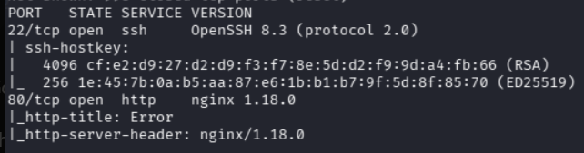
- **Significance:** A minimal attack surface pushes focus onto the web application.
- **Defence:** Keep service banners/versions current; minimise exposed services.

## 2. Web enumeration

- **Objective:** Discover hidden content on the web root.
- **Observation:** Homepage returned a themed 404 ("Harder Corp", powered by php-fpm). Directory brute-forcing revealed `phpinfo.php` (200), `/vendor` (301), and a **`.git`** entry (403). `phpinfo.php` confirmed **PHP 7.3.19 on Alpine**.
- **Technique:** `gobuster` directory enumeration; manual review of `phpinfo`.
- **Evidence:** 

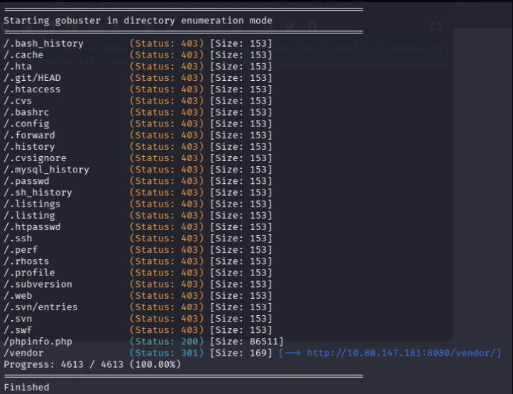
- **Significance:** A `.git` directory on a web root often means the **entire application source** is recoverable.
- **Defence:** Never deploy `.git` to web roots; block dotfiles at the web server.

## 3. Virtual host discovery

- **Objective:** Find application vhosts beyond the default site.
- **Observation:** Two virtual hosts identified — `pwd.harder.local` (a "Password Manager" login) and `shell.harder.local` (a "Web Shell" login).
- **Technique:** Virtual-host enumeration; `/etc/hosts` mapping.
- **Evidence:** 

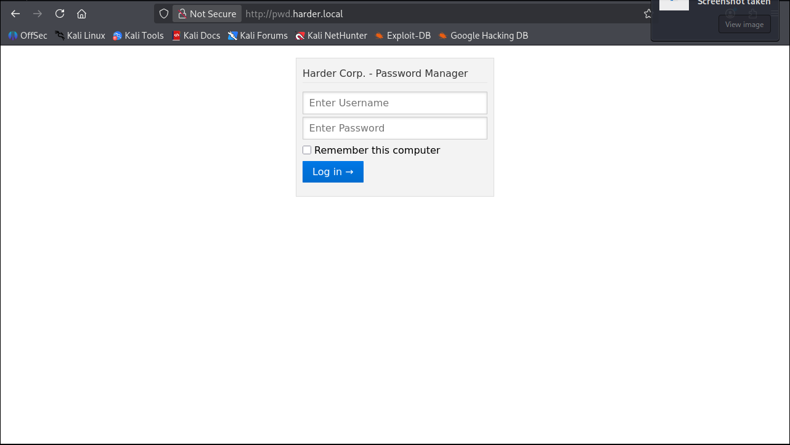
- **Significance:** Name-based vhosts hide functionality that the IP alone does not reveal.
- **Defence:** Treat every vhost as part of the attack surface; don't rely on obscurity.

## 4. Exposed `.git` → source recovery

- **Objective:** Recover application source for white-box analysis.
- **Observation:** The `.git` directory was reachable; dumping it reconstructed the working tree, including `auth.php`, `hmac.php`, and `index.php`.
- **Technique:** `.git` directory dump (git-dumper-style), then local `git`/`ls`.
- **Evidence:** 

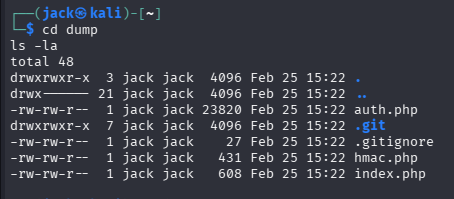
- **Significance:** The engagement effectively became white-box — logic could be read directly.
- **Defence:** Exclude VCS metadata from deployments; use CI artefacts, not working trees.

## 5–6. HMAC verification logic flaw

- **Objective:** Find an exploitable weakness in request validation.
- **Observation:** `hmac.php` required `h` and `host` parameters and compared `hash_hmac('sha256', host, secret)` to the attacker-supplied `h`. Crucially, if an `n` parameter was supplied, the code **recomputed `secret` from attacker input** before the comparison. Supplying `n` as an array / null-like value caused `hash_hmac` to behave in a way that let the check be satisfied with a value the attacker could compute.
- **Technique:** Static source review, then reproduction of the hash locally with `php -r 'echo hash_hmac(...)'`.
- **Evidence:** 

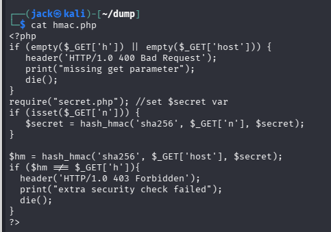, 

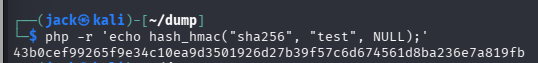
- **Significance:** The "extra security check" was bypassable because attacker-controlled input influenced the **keying material** of the HMAC. A signature check is only sound if the key is secret and fixed.
- **Defence:** Never derive HMAC keys from request parameters; use constant-time comparison; validate parameter **types** (reject arrays where strings are expected).

## 7. Credential disclosure

- **Objective:** Turn the bypass into useful access.
- **Observation:** Exercising the flaw against the password-manager vhost returned a stored entry: a URL (`shell.harder.local`), a username (`evs`), and a **cleartext password** (redacted in the screenshot).
- **Technique:** Crafted request exploiting the HMAC flaw.
- **Evidence:** 

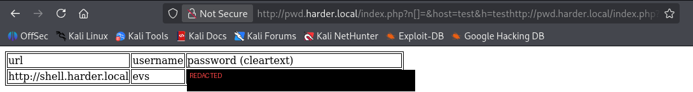 *(password region redacted)*
- **Significance:** Cleartext credential storage compounds the logic flaw into full account takeover.
- **Defence:** Never store recoverable cleartext credentials; segment secrets from the app that displays them.

## 8. X-Forwarded-For access bypass

- **Objective:** Reach the web shell, which refused the attacker's IP.
- **Observation:** `shell.harder.local` responded "Your IP is not allowed... Only 10.10.10.x is allowed". Adding an `X-Forwarded-For: 10.10.10.10` header satisfied the check and granted access to a command-execution page.
- **Technique:** HTTP header injection of a spoofed client IP.
- **Evidence:** 

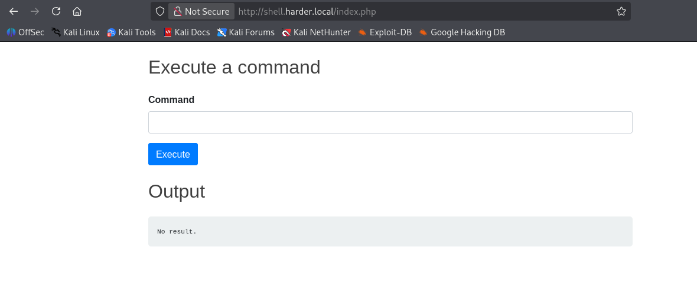
- **Significance:** Access control based on a client-controllable header is no control at all.
- **Defence:** Derive client IP only from the trusted edge; ignore inbound `X-Forwarded-For` unless set by your own proxy.

## 9. Command execution

- **Objective:** Achieve RCE.
- **Observation:** The "Execute a command" page ran supplied input on the host. `whoami` → `www`; `id` → `uid=1001(www)`; `pwd` → `/www/shell`. Directory listing and `user.txt` retrieval followed.
- **Technique:** Authenticated command injection via the web shell.
- **Evidence:** 

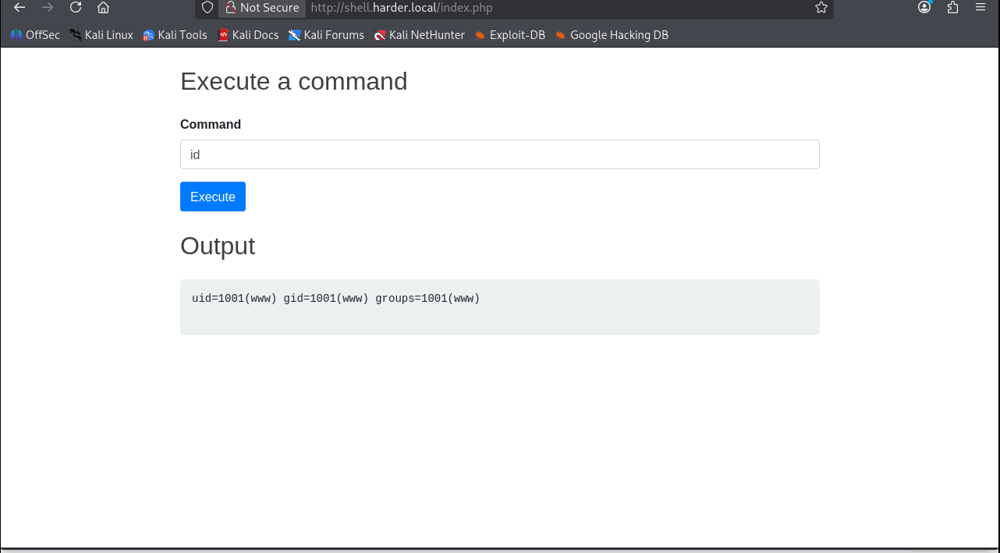
- **Significance:** Full code execution as the web service account.
- **Defence:** Never pass user input to shell execution; drop privileges; sandbox.

## 10. SSH access as `evs`

- **Objective:** Obtain a stable interactive foothold.
- **Observation:** The disclosed credentials authenticated over SSH as `evs` on the Alpine host (`whoami` → `evs`). `user.txt` retrieved (redacted).
- **Technique:** Credential reuse over SSH.
- **Evidence:** 

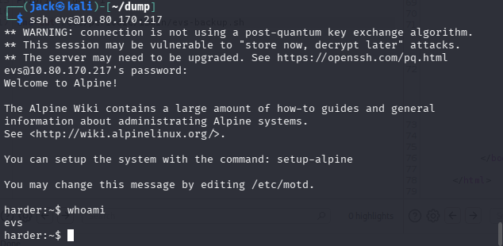
- **Significance:** Credential reuse across services widened access from a web account to a shell user.
- **Defence:** Unique credentials per service; MFA on SSH; monitor logins.

## 11–12. Privilege escalation — root GPG "encrypted command" mechanism

- **Objective:** Escalate from `evs` to root.
- **Observation:** Enumeration found a root-scheduled periodic job (`/etc/periodic/.../evs-backup.sh`) and a root-owned binary `/usr/local/bin/execute-crypted` that **decrypts a GPG file and runs it as root**. Root's **public key** was readable in `/var/backup`. I imported that key, wrote a script that appends my SSH public key to `/root/.ssh/authorized_keys`, encrypted it to root's key (`gpg -r root@harder.local -e exploit.sh`), and invoked `execute-crypted exploit.sh.gpg`.
- **Technique:** Abuse of a privileged decrypt-and-execute mechanism using a reachable recipient key.
- **Evidence:** 

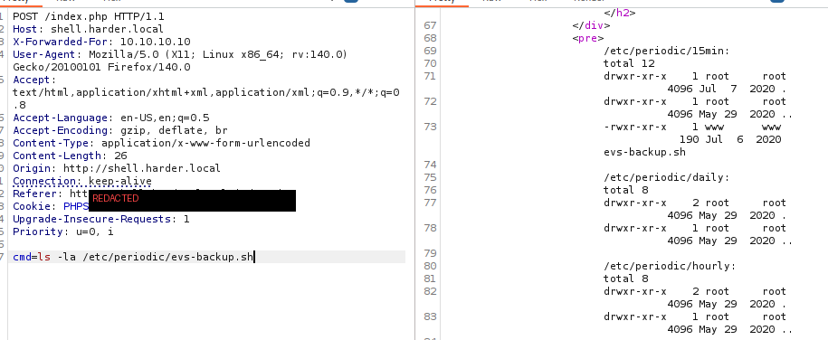, 

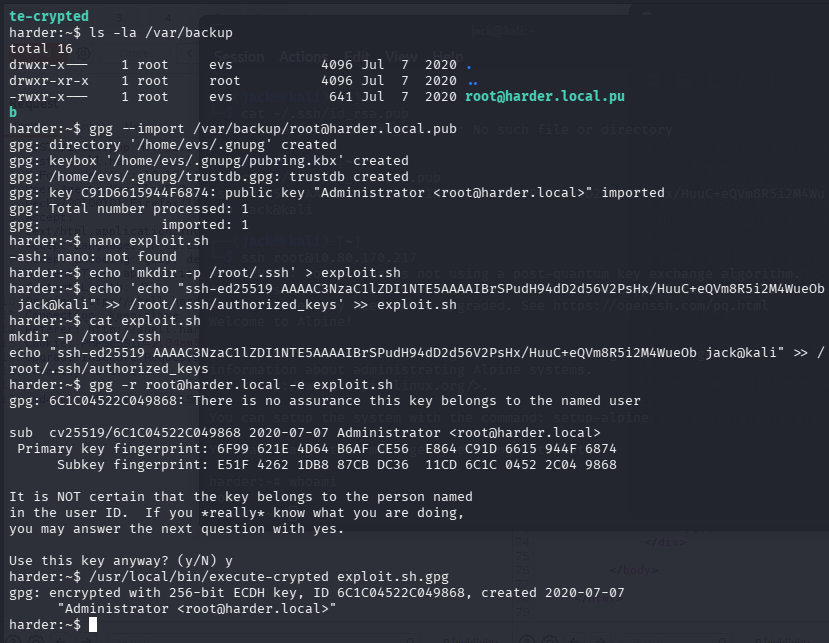
- **Significance:** A mechanism that runs attacker-supplyable encrypted payloads as root is a direct escalation primitive when the recipient key is available.
- **Defence:** Don't run user-writable/derivable payloads as root; protect recipient keys; restrict who can invoke privileged runners.

## 13. Root access

- **Objective:** Confirm full compromise.
- **Observation:** With my key installed in `/root/.ssh/authorized_keys`, `ssh root@<target>` succeeded (`whoami` → `root`); `root.txt` retrieved (redacted).
- **Technique:** SSH as root using the injected key.
- **Evidence:** 

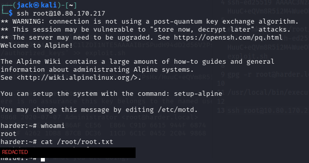
- **Significance:** End-to-end compromise from unauthenticated web recon to root.
- **Defence:** Layered controls — any single break (git exposure, HMAC flaw, header trust, cleartext creds, privileged GPG runner) could have stopped the chain.

---

## Key takeaways

1. **Exposed `.git` is high-impact** — it converts black-box to white-box.
2. **Signature checks fail when keys are attacker-influenced** — the HMAC flaw is the standout lesson.
3. **Never trust client headers for authorisation.**
4. **Privileged "run this for me" mechanisms** are prime escalation targets.

## Limitations

Single designed CTF host; all vulnerabilities were intentionally planted. This is a learning
exercise demonstrating methodology and reasoning, not discovered/novel research.

## Ethical / legal scope

Conducted entirely within TryHackMe's authorised, isolated lab. These techniques must only be
used against systems you own or are explicitly authorised to test.
